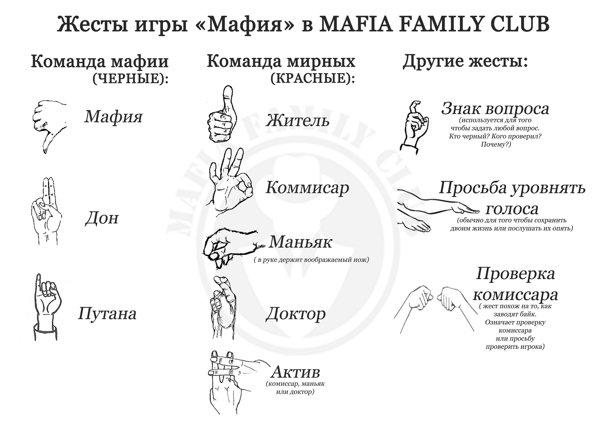

# Правила игры в "Мафию"

## Основные правила

За столом одновременно играет 12 игроков (город). Они делятся случайным образом на две команды, получая специальные карты с ролями. Одна команда – черные (дон мафии, мафия и путана), другая команда – красные (мирные жители, доктор, комиссар, маньяк). Задача каждой из команд – убить всех соперников.

## Распределение ролей

За столом присутствуют дон мафии, две мафии, путана, комиссар, доктор, маньяк и мирные жители.

## Фазы

Игра состоит из сменяющихся дня и ночи. В начале игры, сразу после раздачи карт, наступает первая ночь, когда все закрывают глаза, и просыпаются только черные игроки, которые знакомятся друг с другом: дон показывает пальцами пистолет, а путана демонстрирует мизинец. В первую ночь ни у одной из активных ролей нет действия, лишь знакомство друг с другом.

## Фаза: день

Днём все игроки сначала общаются между собой 2 минуты (балаган). А затем наступает очередь монологов. У каждого игрока за столом есть номер. Начиная с первого все по очереди высказываются не более 30 секунд. В конце речи следует говорить «спасибо». Каждый новый круг начинает говорить/голосовать следующий номер. При этом на сменяемость порядка высказываний/голосований не влияют оправдательные речи. В свою очередь оправдательные речи так же начинаются с наименьшего номера (после того человека, который начинал голосовать первым ).

**Пример**. *Если первым высказывался номер 1, то голосование начнется с номера 2, оправдательные речи с номера 3 (если номера 3 нет среди оправдывающихся, то оправдываться начинает следующий после него оправдывающийся игрок), переголосование также с номера 3.*

Переголосование может быть только одно. Если и по его итогам максимальное количество пальцев у нескольких игроков, то объявляется мирный день (никто не умирает) и наступает ночь. В случае, если во время первого голосования все игроки получили по одному пальцу, то объявляется мирный день.

Примечание: если на переголосовании осталось два игрока, то они не голосуют. Если больше двух, то голосуют все игроки. Нельзя голосовать против себя. Нельзя воздержаться от голосования.

Убитый днём игрок имеет 30 секунд на прощание с городом, чтобы помочь своей красной или черной команде. При этом убитый днём дон после вскрытия карты имеет право забрать с собой в могилу (убить) любого игрока (для черных желательно – комиссара, доктора или маньяка). В этот момент ни один игрок не имеет права подсказывать дону, кого стоит забрать в могилу. Строго запрещены любые жесты и звуки в то время, когда у убитого дона есть 30 секунд на прощание.

У игрока, которого забирает дон, так же есть 30 секунд на прощание с городом. Если же ночью маньяк убивает дона, то у него нет возможности забрать с собой кого-либо в могилу.

## Фаза: ночь

Ночью поочередно просыпаются все кроме мирных жителей. При этом крайне важно не издавать никаких звуков, чтобы не выдать сопернику свою роль. Для этого ночью играет музыка, а на игроках надеты маски. Ночью строго запрещено жестикулировать и издавать звуки. Исключение лишь для игроков, которых пробуждает ведущий – они могут жестикулировать.

* **Мафия**

  Ночью первой просыпаются вместе дон мафии и мафия (без путаны). Они совещаются и беззвучно сообщают ведущему, кого они убивают этой ночью. При этом решающее слово за доном мафии.

* **Путана**

  Затем просыпается путана. Ее задача ночью «заморозить» активного красного игрока (доктора, комиссара или маньяка). Если путана указывает на комиссара, то он в эту ночь не проверяет, если на доктора – он не лечит, если на маньяка – он не убивает. Если игрока заморозили, то ведущий показывает ему жест путаны (мизинец) после того, как замороженный игрок сообщает ему своё решение . Если путана морозит мирного жителя, то ничего не происходит. Если путана по ошибке морозит последнюю оставшуюся мафию, то выстрел мафии не засчитывается, так как мафия была заморожена. Путана не имеет права «морозить» одного игрока более двух ночей подряд. Если же по ходу игры так получилось, что у черных осталась только путана, то у нее есть возможность и убивать, и морозить.

* **Доктор**

  Следующим просыпается доктор. Он лечит любого игрока. При этом лечить одного и того же человека (в том числе и себя) можно не более одной ночи подряд. Ситуация, когда доктор лечил игрока N - заморожен - лечил игрока N разрешена. Доктор лечит от всего: убийства мафии, убийства маньяка, заморозки путаны.

  **К примеру***, если в одну ночь комиссар был убит мафией, заморожен путаной и убит маньяком, то лечение доктора сохраняет этому игроку жизнь и сохраняет возможность проверить игрока. Если путана заморозила доктора, то он себя вылечить уже не сможет.*

* **Комиссар**

  Потом просыпается комиссар. Ночью он имеет возможность проверить любого сидящего за столом игрока на его принадлежность к черным. Об этом беззвучно сообщит ведущий соответствующим знаком: если игрок черный – палец вниз, а если красный – палец вверх (в первую ночь ведущий напоминает комиссару эти обозначения). Комиссар имеет возможность оставить ведущему записку (результат проверки в эту ночь), которая будет оглашена ведущим днем только в том случае, если комиссар был убит. Записку следует оставлять, если комиссар предполагает, что в эту ночь его могут убить. Записку можно оставить только сразу после проверки, показав ведущему будто ты что-то пишешь невидимым карандашом (многие этим жестом просят счет в ресторане). Комиссар имеет право оставить лишь одну записку за игру. Если комиссар оставляет записку, а его не убивают, то записка сгорает.

  *Комиссар имеет право проверять одного и того же игрока несколько раз. Теоретически этот ход может быть полезным для красных, если комиссар полагает, что его этой ночью убьют и хочет оставить записку о черной проверке.*

* **Маньяк**

  Последним просыпается маньяк. Он играет за мирных жителей (красных). Ночью он имеет право убить любого игрока и стремится указать на мафию или путану. Маньяк имеет право воздержаться от убийства. Самоубийство исключено.

*  **Мирные жители**
  Мирные жители ночью не просыпаются. После того, как все активные роли проснулись и сделали свои действия, снова наступает день. Ведущий позволяет игрокам проснуться и объявляет, кто был убит ночью. После этого снова наступает 2 минуты балагана. У игроков, убитых ночью нет 30 секунд для прощания с городом. Они покидают стол без звуков и без жестов.

## Окончание игры

Если не осталось живых игроков, объявляется ничья. Если живых игроков не осталось только у одной из команд, победа присуждается противоположной команде.

Красные выигрывают только когда убиты все игроки чёрной команды. В свою очередь чёрные могут выиграть досрочно, если при правильных действиях они могут гарантировать себе победу.

**Например***, если не осталось маньяка, а черных игроков не меньше, чем красных. А также, если не осталось доктора, и число игроков красной команды меньше числа игроков чёрной команды.*

## Фолы

За любые нарушения правил (мат, высказывания вне своей очереди, оскорбления и т.д.) игрок получает один фол. За любые звуки или жестикуляцию ночью, ночные аргументы (*я слышал, как он двигался ночью*), нарушение правил, которое повлияло на ход игры игрок получает от двух фолов до удаления – на усмотрение ведущего. За попытку дать/получить информацию – удаление и пропуск от одной игры до исключения из клуба по решению совета. За шевеления ночью не влияющие на игру – два фола.

Если у игрока накапливаются три фола за игру, то он получает палец на ближайшем голосовании. Четвертый фол – вскрытие карты и уход игрока из-за стола. В случае вскрытия карты из-за четырех фолов человек не имеет 30 секунд на прощание. При этом день продолжается. Город может как проголосовать за убийство нового игрока, так и голосовать в игрока ушедшего по фолам, тогда в этот день убийств больше не будет.

Запрещено нарочно получать фолы с тем, чтобы самоубийством помочь своей команде. В таких ситуациях объявляется победа противоположной команды. Умышленное самоубийство – достаточно спорный момент, потому что любой игрок может сказать, что он не планировал уходить из-за стола. Такие моменты остаются на усмотрение ведущего. Если он считает, что самоубийство было осознанным поступком во благо интересов команды, то ведущий должен объявлять поражение команде, где человек нарочно набрал один или несколько фолов.

Если у дона мафии есть хотя бы три фола, то он лишается права «забрать в могилу» игрока.

## Разное

Все игроки обязаны придерживаться норм этики, толерантности к другим игрокам, не создавать балаган и беспрекословно выполнять указания ведущего. Только ведущий имеет право оглашать результаты дня, ночи и победу той или иной команды. Без разрешения ведущего вскрывать карту запрещено. Прикасаться к карте другого игрока запрещено.

Каждый игрок может во время балагана или своей речи может обратиться к ведущему (через поднятие руки) с целью инициировать досрочное голосование. В таком случае ведущий спрашивает игроков (не прерывая речи / балагана): “Кто за досрочное голосование?”. Если за досрочное голосование не проголосовало более одного игрока, то игра продолжается. Иначе, город переходит к голосованию.

Сразу по окончании игры ведущий объявляет, у кого были активные роли и коротко рассказывает о ключевых моментах. Затем, каждый игрок, начиная с первого номера имеет по 30 секунд, чтобы поделиться впечатлениями и отдать голос в рейтинг лучшему игроку по его мнению.

За игнорирование объявлений и замечаний ведущего, нарушители дисквалифицируются: от одного игрового дня и вплоть до исключения из клуба. Употребление алкоголя на мафии запрещено.

## Знаки

Поскольку большую часть дня человек не имеет права говорить, существует язык жестов, который может пригодиться и ночью. Чтобы беззвучно указать на игрока достаточно на пальцах показать его номер. При этом кулак означает «10». 

Остальные жесты выглядят следующим образом.

<!---
Это значит, что 11-й номер следует показывать так:

11-й номер

Черный

Красный

Почему?

дон мафии

Путана

Доктор (два варианта)

Комиссар (два варианта)

Маньяк

Активная красная карта (доктор, комиссар или маньяк)

Комиссар, проверь

Играем в команде
Конфликтуем
-->

## Рейтинг

После окончания игры каждый игрок отдаёт рейтинговый голос лучшему, по его мнению, игроку. Также, за действия, которые привели к победе или поражению команды игрока, ведущий, по своему усмотрению, может добавить не более трёх рейтинговых голосов (суммарно на весь стол), или отнять не более трёх рейтинговых голосов (у каждого игрока). За нижеследующие действия игрок автоматически получает или лишается рейтинговых голосов:

* +1 для мирного жителя за смерть от мафии в первую ночь

* +1 для мирного жителя за смерть от дона в первый день

* +1 для маньяка за убийство чёрного в первую ночь, при условии, что по результатам голосования маньяк получил 0 голосов

* -3 за смерть по фолам, или в результате случайно открытой карты

* -1 для маньяка за убийство мирного жителя в первую ночь (при условии, что этот игрок не добивал красного игрока на голосовании в первый день)

* -2 для маньяка за убийство активной карты в первую ночь (при условии, что этот игрок не добивал красного игрока на голосовании в первый день)

* -1 для красного за решающий голос (добивание) мирного жителя в первый день. Ещё минус один получит этот игрок, если его убьёт маньяк в первую ночь.

* -2 для красного за решающий голос (добивание) активной карты в первый день. Ещё минус один получит этот игрок, если его убьёт маньяк в первую ночь.

* -1 для маньяка за выстрел, который привёл к поражению красной команды, при условии, что в случае отказа от выстрела, игра бы продолжилась.

* -1 для маньяка за отказ от выстрела, который привёл к поражению красной команды, при условии, что в случае выстрела, игра могла бы продолжиться.

* -1 для игрока, который мог своим действием гарантировать победу своей команды, но ошибся (при условии, что он обладал всей необходимой информацией). Ещё -2, если в результате его команда проиграла

## Новички

Каждый член клуба может привести на игру одного новичка, предварительно подробно объяснив ему правила (косяки новичка, совершённые по незнанию правил, лежат на совести приведшего его члена). Чтобы заявить новичка, его нужно вписать в комментариях в группе, но их должно быть не больше пяти. При этом за столом может быть не более 3 новичков. После нескольких игровых дней Совет клуба может принять новичка в члены клуба. В свою самую первую игру каждый новичок имеет иммунитет на первый день и первую ночь (но его может убить маньяк, если новичок добил в первый день красного игрока).

## Жизнь клуба

Клуб создан, чтобы встречаться с друзьями, развлекаться и развиваться, играя в мафию. За опыт, заслуги и инициативность игроки могут быть приняты в Совет клуба и участвовать в его стратегическом развитии.

Максим Петрунин, Григорий Телингатер, Михаил Прибыловский, Сергей Лыжин
